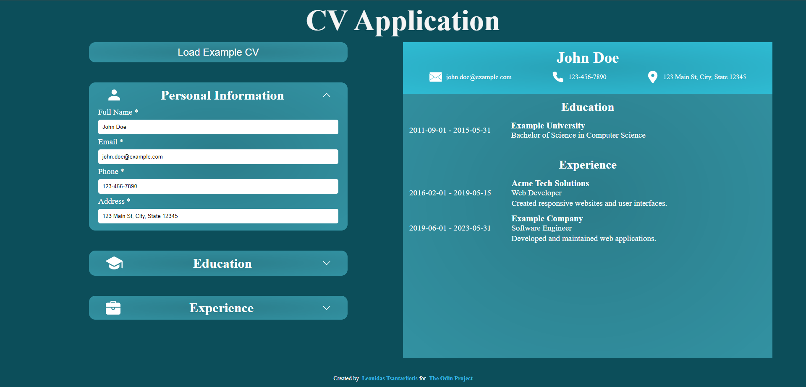

# CV-Application

Live Demo:  
https://leo-tsant-cv-application.netlify.app/

## Overview

This project was created for the [CV Application assignment](https://www.theodinproject.com/lessons/node-path-react-new-cv-application) as part of [The Odin Project](https://www.theodinproject.com/) curriculum. It features an application built with React where users can dynamically create and edit their CV (resume). Users can input their personal information, work experience, education, and skills, which are then rendered into a clean and professional CV format.

## Technologies Used

-   **React**
-   **JavaScript**
-   **CSS**
